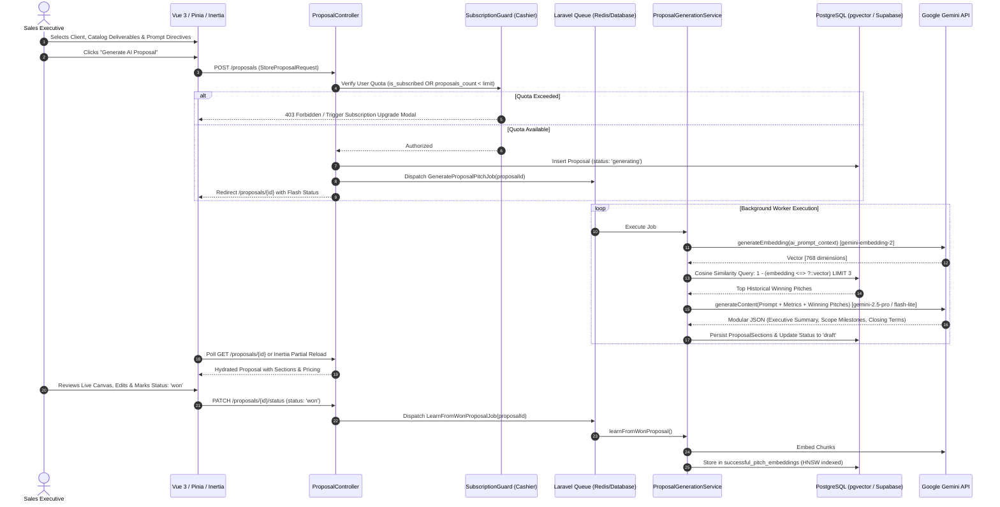
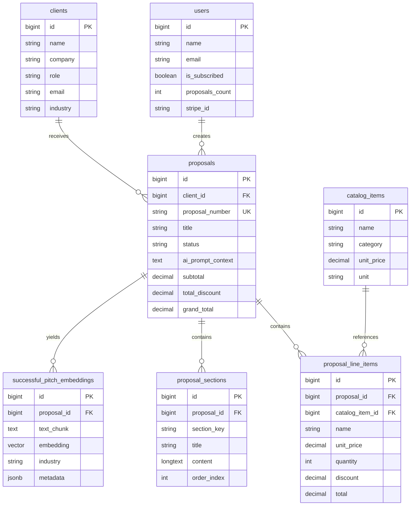

# ProposalAI — Enterprise B2B AI Proposal Generator

[](https://laravel.com)
[](https://vuejs.org)
[](https://inertiajs.com)
[](https://github.com/pgvector/pgvector)
[](https://supabase.com)
[](https://ai.google.dev)
[](https://tailwindcss.com)

**ProposalAI** is a production-grade, multi-tenant enterprise B2B platform engineered to automate the composition, financial modeling, and dispatch of high-conversion sales proposals. By unifying a modern **Vue 3 + Inertia.js** single-page architecture with a resilient **Laravel 11** backend, PostgreSQL vector similarity search (**pgvector** via Supabase), and Google's **Gemini AI models**, ProposalAI accelerates proposal drafting from hours to seconds while continually learning from winning contracts.

---

## Table of Contents

1. [Project Overview](#project-overview)
2. [System Architecture & Workflow](#system-architecture--workflow)
3. [Frontend Structure](#frontend-structure)
4. [Backend Structure](#backend-structure)
5. [Database Schema & Vector Store](#database-schema--vector-store)
6. [Testing Strategy](#testing-strategy)
7. [Setup & Installation](#setup--installation)
8. [License](#license)

---

## Project Overview

B2B sales teams frequently struggle with repetitive proposal drafting, fragmented pricing calculations, and inconsistent closing arguments. ProposalAI solves this by offering an end-to-end automated platform featuring:

- **Automated AI Drafting**: Steers Google Gemini (Flash-Lite 3.5 / 2.5 Pro) with contextual client dossiers, line-item financials, and historical won pitches retrieved via semantic search.
- **Master Deliverables Catalog**: Enables sales reps to curate itemized deliverables, adjust volume quantities, and apply granular line-item discounts with real-time margin and tax recalculations.
- **Client Intelligence & CRM Profiles**: Centralizes client enterprise metadata (industry, point-of-contact roles, compliance requirements) to inject personalized value propositions into every pitch.
- **Freemium & Subscription Gates**: Implements subscription tiering via **Laravel Cashier (Stripe)**. Free-tier accounts are restricted by monthly proposal quotas (`proposals_count` validation), prompting users with upgrade paywalls when thresholds are reached.
- **Self-Improving RAG Flywheel**: When a proposal status transitions to `won`, the system chunks its sections, generates dense embeddings, and stores them in Supabase `pgvector` for future few-shot retrieval.

---

## System Architecture & Workflow

ProposalAI follows a decoupled, queue-centric asynchronous architecture to safeguard user experience against third-party AI latency.



### End-to-End Execution Breakdown

1. **Catalog & Context Curation**: The user builds a bill-of-materials from the catalog and provides strategic directives (e.g., *"Focus on 6-month ROI and zero-downtime microservices cutover"*).
2. **Freemium Limit Check**: The request passes through authorization middleware. If an un-subscribed user has reached their free proposal limit, a structured payload triggers the frontend Stripe checkout modal.
3. **Optimistic Staging & Queue Dispatch**: A `Proposal` record is instantiated in `generating` state. The compute-intensive AI generation task is pushed to Laravel's asynchronous queue (`GenerateProposalPitchJob`).
4. **Retrieval-Augmented Generation (RAG)**: The worker calls `GeminiService` to obtain a dense 768-dimension vector representation of the user directive, then queries Supabase using cosine distance (`<=>` operator) against previously won contracts.
5. **Modular Synthesis**: The prompt combines client attributes, calculated line totals, and top retrieved historical pitches. Gemini returns three modular sections (`executive_summary`, `scope_and_timeline`, `closing`) under strict JSON schema enforcement.
6. **Continuous Learning**: Marking a proposal as `won` triggers `LearnFromWonProposalJob`. Winning phrasing is automatically indexed into `successful_pitch_embeddings` tagged by industry for perpetual RAG refinement.

---

## Frontend Structure

The frontend is housed in `frontned/` and compiled with Vite. It leverages Vue 3 Composition API (`<script setup>`), Pinia state management, and Inertia.js for transparent client-server communication.

```
frontned/src/
├── Components/
│   ├── ProposalPreview/             # Live rendering engine mirroring physical documents
│   │   ├── DocumentPreview.vue       # Composite container with print/export/copy controls
│   │   ├── ExecutiveSummarySection.vue # Dynamic rich-text display with AI shimmer states
│   │   ├── PricingTableSection.vue   # Itemized invoice table with auto-calculated summaries
│   │   └── ScopeSection.vue          # Phased milestone cards (Title, Timeline, Deliverable)
│   └── Steps/                        # Multi-step wizard views
│       ├── ClientStep.vue            # Client dossier selector & CRM search
│       ├── CatalogStep.vue           # Deliverables catalog grid with category filters & quantity counters
│       ├── AiContextStep.vue         # Strategic directive textarea, tone selector, audience picker
│       └── ReviewStep.vue            # Final audit checklist & dispatch trigger
├── Layouts/
│   └── AppLayout.vue                 # Persistent navigation sidebar, header, flash notification toasts
├── Pages/
│   ├── Catalog.vue                   # Master catalog index and administrative pricing manager
│   ├── Clients.vue                   # Client intelligence directory
│   ├── Dashboard.vue                 # Pipeline metrics, conversion analytics, and recent activity
│   └── Proposals/
│       ├── Create.vue                # Interactive dual-column split builder (Form + Live Canvas)
│       ├── Index.vue                 # Filterable, sortable proposals directory (Cards vs. Table views)
│       └── Show.vue                  # Read-only and client portal view with PDF print stylesheets
└── stores/
    └── proposalStore.js              # Central Pinia store managing wizard state and financial logic
```

### Pinia State Management Highlights (`proposalStore.js`)
- **Reactive Financial Ledger**: Real-time recalculation of `subtotal`, `totalDiscountAmount`, `discountedSubtotal`, `taxAmount`, and `grandTotal`.
- **Live AI Engine Indicators**: Independent generation flags (`isGenerating.executiveSummary`, `isGenerating.scope`, `isGenerating.full`) driving animated skeleton loaders across the live canvas.
- **Subscription Modal Triggers**: Tracks API quota responses to immediately open the Stripe upgrade dialog without page reloads.

---

## Backend Structure

The backend is built on Laravel 11 adhering to Clean Architecture principles: **Controllers** coordinate HTTP responses, **Form Requests** isolate validation and state-machine policies, the **Service Layer** encapsulates external integrations and calculations, and **Eloquent Models** govern relational and vector persistence.

```
backend/app/
├── Http/
│   ├── Controllers/
│   │   └── ProposalController.php        # Thin resource controller rendering Inertia responses
│   ├── Middleware/
│   │   └── HandleInertiaRequests.php     # Global shared props (session flashes, auth, limits)
│   └── Requests/
│       ├── StoreProposalRequest.php      # Validates client existence, prompt limits (1000 chars), item arrays
│       └── UpdateProposalStatusRequest.php # Validates status transitions ('draft' -> 'sent' -> 'won' -> 'lost')
├── Jobs/
│   ├── GenerateProposalPitchJob.php      # Asynchronous worker job for LLM section synthesis
│   └── LearnFromWonProposalJob.php       # Background worker job for vectorizing won proposals
├── Models/
│   ├── CatalogItem.php                   # Deliverables catalog item with unit pricing
│   ├── Client.php                        # Client profile with CRM metadata
│   ├── Proposal.php                      # Aggregate root with status state machine & totals
│   ├── ProposalLineItem.php              # Financial snapshots with applied volume discounts
│   ├── ProposalSection.php               # Modular generated sections (executive_summary, scope, closing)
│   ├── SuccessfulPitchEmbedding.php      # Vector entity cast with Pgvector\Laravel\Vector
│   └── User.php                          # Billable entity with Cashier subscription traits
└── Services/
    ├── GeminiService.php                 # HTTP client wrapper with retry backoff & JSON schema parser
    └── ProposalGenerationService.php    # RAG vector retrieval, financial sync, and section persistence
```

### Key Service Classes

- **`GeminiService`**: Uses Laravel's `Http::withHeaders()` to handle communication with `generativelanguage.googleapis.com`. Configured with configurable timeouts, automatic retry backoff (`retry(2, 500, throw: false)`), schema validation, and typed domain exceptions (`GeminiApiException`).
- **`ProposalGenerationService`**:
  - `generatePitch(Proposal $proposal, array $data)`: Computes financial snapshots, queries top-3 similar historical chunks using pgvector cosine distance, and synthesizes modular sections.
  - `learnFromWonProposal(Proposal $proposal)`: Splits winning content into semantic paragraphs, generates embeddings via `gemini-embedding-2`, and stores them with industry metadata.

---

## Database Schema & Vector Store

ProposalAI utilizes **PostgreSQL 17** hosted on **Supabase** with the native **`pgvector`** extension enabled.



### Table Definitions

| Table Name | Primary Role | Key Columns / Indexes |
| :--- | :--- | :--- |
| **`users`** | Authentication & Billing | `id`, `email`, `is_subscribed`, `proposals_count`, `stripe_id`, `pm_type` |
| **`clients`** | Customer CRM Profiles | `id`, `name`, `company`, `role`, `email`, `industry` *(indexed)* |
| **`catalog_items`** | Deliverables Catalog | `id`, `name`, `category` *(indexed)*, `unit_price`, `unit`, `default_quantity` |
| **`proposals`** | Core Proposal Record | `id`, `client_id` *(FK)*, `proposal_number` *(unique)*, `status` *(indexed)*, `subtotal`, `grand_total` |
| **`proposal_line_items`** | Itemized Deliverables | `id`, `proposal_id` *(FK)*, `catalog_item_id` *(FK nullable)*, `unit_price`, `quantity`, `discount`, `total` |
| **`proposal_sections`** | Modular Generated Content | `id`, `proposal_id` *(FK)*, `section_key` (`executive_summary`, `scope_and_timeline`, `closing`), `content`, `order_index` |
| **`successful_pitch_embeddings`** | Semantic RAG Memory | `id`, `proposal_id` *(FK)*, `text_chunk`, `embedding` (`vector(768)`), `industry`, **HNSW Cosine Index** (`vector_cosine_ops`) |
| **`jobs`** | Asynchronous Queue | `id`, `queue`, `payload`, `attempts`, `reserved_at`, `available_at`, `created_at` |

---

## Testing Strategy

ProposalAI enforces strict quality guarantees through automated testing across both layers:

```
Test Results:
  PASS  Tests\Unit\ExampleTest
  PASS  Tests\Unit\GeminiServiceTest (5 tests)
  PASS  Tests\Feature\ExampleTest
  PASS  Tests\Feature\ProposalGenerationServiceTest (1 test)
  PASS  Tests\Feature\ProposalTest (7 tests)

  Total: 15 passed (70 assertions)
```

### Backend Testing (Pest / PHPUnit)
- **Unit Isolation**: `GeminiServiceTest` mocks HTTP transports (`Http::fake()`) to verify JSON schema parsing, markdown fence removal, exponential retry backoff, and 4xx/5xx error conversion into `GeminiApiException`.
- **Feature & Workflow Verification**: `ProposalTest` simulates end-to-end HTTP calls verifying validation boundaries (character limits, deliverable existence), financial total calculation, Inertia page rendering, and state machine transition rules.
- **RAG & Vector Math**: `ProposalGenerationServiceTest` seeds vectors and asserts proper cosine similarity calculation on live Supabase pgvector instances.
- **Queue Assertions**: `Queue::fake()` verifies that `LearnFromWonProposalJob` is dispatched exclusively upon valid transition to `won`.

### Frontend Testing (Vitest)
- **Store Boundary Tests**: Exercises Pinia mutations to confirm calculation accuracy (discounts, taxes, quantity adjustments).
- **Component Unit Tests**: Verifies that `DocumentPreview` reacts properly to streaming states and renders phased scope deliverables cleanly.

---

## Setup & Installation

### Prerequisites
- **PHP 8.3+** with `pdo_pgsql`, `pgsql`, `curl`, `mbstring`, and `openssl` extensions enabled
- **Composer 2.x**
- **Node.js 20+** and **npm**
- **Supabase Account** (or local PostgreSQL 16+ instance with `pgvector` enabled)
- **Google Gemini API Key**

---

### 1. Clone the Repository
```bash
git clone https://github.com/your-org/ai-proposal-generator.git
cd ai-proposal-generator
```

---

### 2. Configure the Backend (Laravel 11)

```bash
cd backend
composer install
cp .env.example .env
php artisan key:generate
```

Configure your `.env` with your Supabase database credentials, Gemini API key, and Stripe keys:

```env
APP_NAME="ProposalAI"
APP_ENV=local
APP_URL=http://localhost:8000

# Database (Supabase PostgreSQL w/ pgvector)
DB_CONNECTION=pgsql
DB_HOST=aws-0-ap-southeast-1.pooler.supabase.com
DB_PORT=5432
DB_DATABASE=postgres
DB_USERNAME=postgres.YOUR_PROJECT_REF
DB_PASSWORD=YOUR_DB_PASSWORD
DB_SSLMODE=require

# Queue & Cache
QUEUE_CONNECTION=database

# Google Gemini API
GEMINI_API_KEY=your_actual_gemini_api_key
GEMINI_BASE_URL=https://generativelanguage.googleapis.com/v1beta
GEMINI_EMBEDDING_MODEL=gemini-embedding-2
GEMINI_PRO_MODEL=gemini-2.5-pro
GEMINI_FLASH_MODEL=gemini-2.5-flash

# Stripe / Laravel Cashier (Optional for freemium testing)
STRIPE_KEY=pk_test_...
STRIPE_SECRET=sk_test_...
STRIPE_WEBHOOK_SECRET=whsec_...
```

Run database migrations and seed the initial enterprise catalog and RAG embeddings:

```bash
php artisan migrate:fresh --seed
```

Start the queue worker in a background terminal:
```bash
php artisan queue:work
```

Boot the Laravel application server:
```bash
php artisan serve --port=8000
```

---

### 3. Configure the Frontend (Vue 3 + Vite)

In a separate terminal:

```bash
cd frontned
npm install
npm run dev
```

The application is now live at: **`http://localhost:8000`** (or Vite dev server at `http://localhost:5173`).

---

### 4. Running the Test Suite

Run backend Pest / PHPUnit tests:
```bash
cd backend
php artisan test
```

Run frontend Vitest suites:
```bash
cd frontned
npm run test
```

---

## License

ProposalAI is open-sourced software licensed under the **[MIT license](LICENSE)**.

